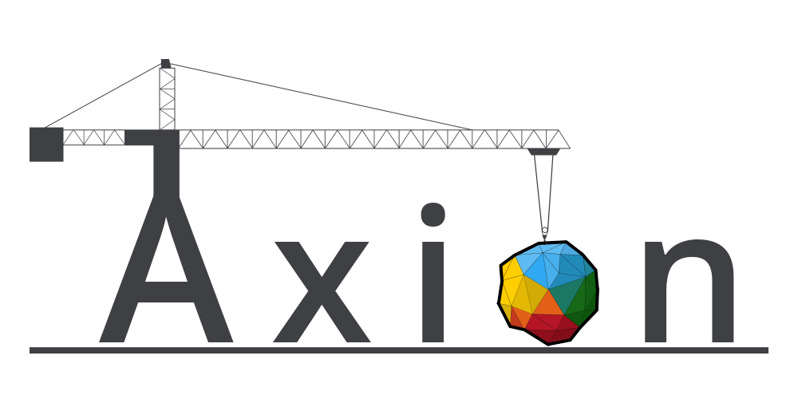

## Welcome to Axion programming language toolset
### ::::::::::::::::::::::::::::::::::::: Under construction :::::::::::::::::::::::::::::::::::::

### Objectives

- **General-purposed**
- **High-performance**
- **Static typed**
- **Safe**
- **Simple**
- **Readable**

### Paradigms

- **Object-oriented**
- **Reactive**
- **Functional (extension)**

### Progress

- **Console interactive interpreter**
- **Lexer (Tokenizer)**
- **Parser is still under construction.**
	*(Not working by last release time)*
- **Transpiling to C or C++ is planned**
	
### Syntax examples

- ***Basic operations***
	```python
	1 + 2, variable += "string", otherVar = 90.0, etc.
	```
- ***Branching***
	```python
	if condition: 
		doSomething()
	elif condition: 
		doSomethingElse()
	else: call()
	```
- ***Collections indexers***
	```python
	item = collection[index]
	item = collection[0]
	value = someMap["key"]
	```
- ***Collections initializing***
	```python
	# inaccurate version yet
	#
	# ARRAY
	collection = int[5]
	collection = { 1, 2, 3, 4, 5 }
	collection = int { 1, 2, 3, 4, 5 }
	#
	# MATRIX
	collection = int[3, 2]
	collection = { {1, 2}, {3, 4}, {5, 6} }
	collection = int { {1, 2}, {3, 4}, {5, 6} }
	#
	# LIST
	collection = int[*]
	collection = int* { 1, 2, 3, 4, 5 }
	#
	# MAP
	collection = { int, str }
	collection = { 1: "Text1", 2: "Hello, world!", 55: "Other string" }
	```
- ***Function calls***
	```js
	call(arg1, arg2, arg3)
	functionCall(nestedCall(arg1, arg2), 12345)
	```

### Licensed code usage
- **This project uses some code from [IronPython 2 compiler](https://github.com/IronLanguages/ironpython2)
   that is licensed under Apache License 2.0**
